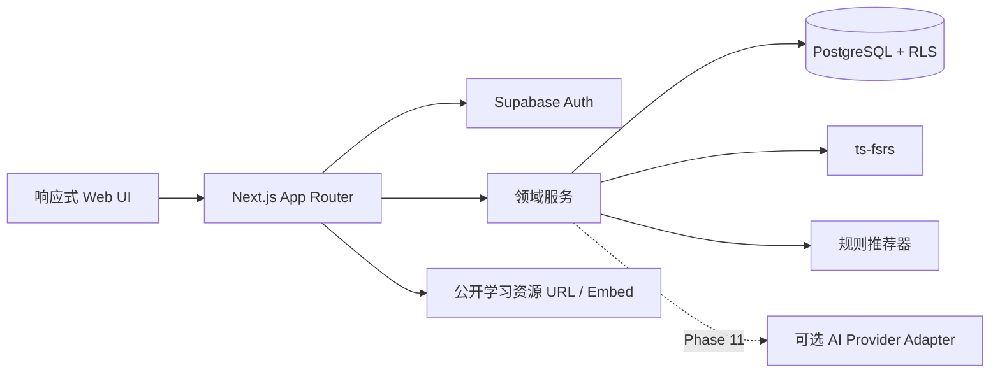
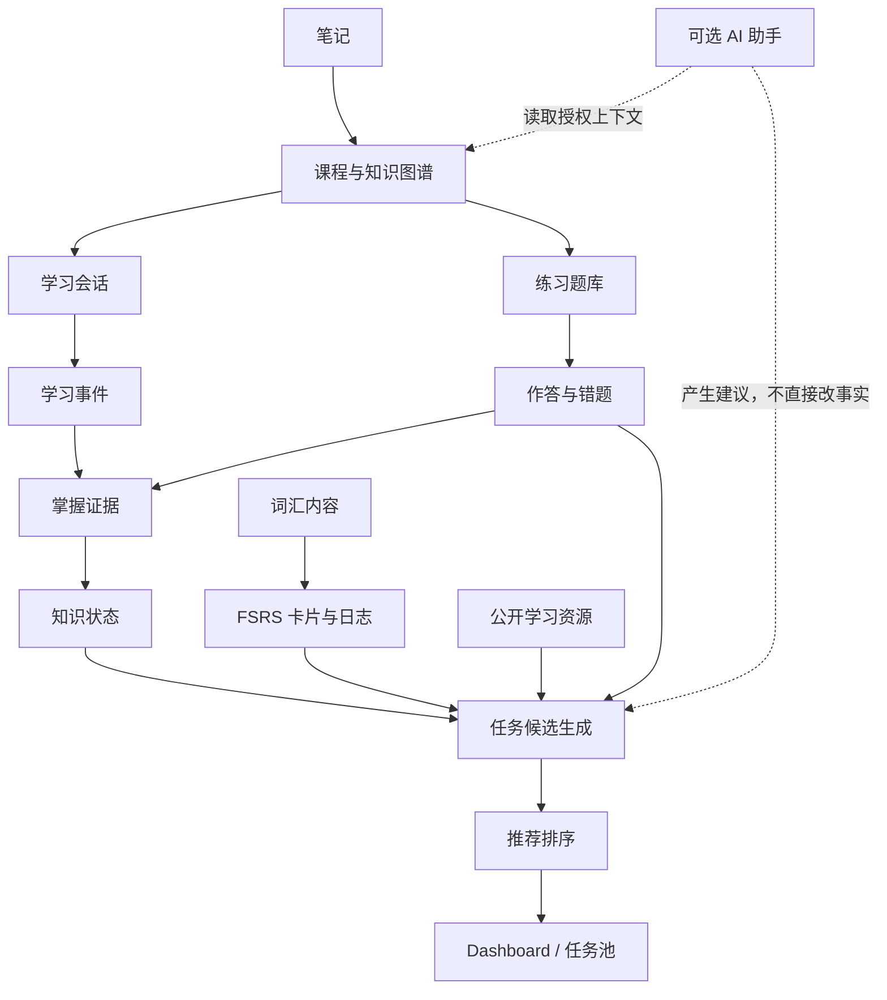

# 个人学习系统 - 产品与技术规格

> 状态：Phase 0 设计稿（待确认）  
> 日期：2026-09-21  
> 目标读者：产品所有者、开发者、内容维护者

## 1. 产品定义

这是一个面向个人长期使用、支持手机与桌面浏览器的学习 Web App。它不是日程表或 Todo List，而是围绕以下三件事工作：

1. **学习状态**：系统持续记录用户学过什么、学到哪里、掌握程度、薄弱点、错题、笔记和复习状态。
2. **任务池**：当前课程、未完成内容、薄弱知识点、错题、到期单词和合适的公开资源都可以成为候选任务。
3. **自适应推荐**：每次打开应用时，根据当前真实状态重新计算“现在最适合继续什么”，而不是强制执行固定日计划。

第一阶段支持数学和英语，内容模型必须允许以后增加其他学科。首版不依赖 AI；没有 AI 时，课程、进度、练习、错题、词汇复习和任务池仍需完整可用。

## 2. 产品原则

- **状态优先**：事实记录与掌握状态是推荐的依据。
- **不惩罚中断**：几天不学习不会制造“逾期失败”；回归时只重新排序合适任务。
- **内容数据化**：课程、章节、知识点、先修关系和资源都存数据库，不硬编码数学课程终局。
- **证据可解释**：掌握度和推荐都要能说明依据，并记录算法版本。
- **渐进增强**：规则系统先可用，AI 以后作为辅助能力接入。
- **版权克制**：保存公开资源 URL、元数据和允许的嵌入，不下载或重新托管版权视频。
- **长期可维护**：采用模块化单体和少量边界清晰的依赖，不拼装多个完整 LMS。

## 3. 用户与首期范围

### 3.1 用户

- 首期按单用户产品体验设计，但所有用户数据从第一天起按 `user_id` 隔离。
- 支持账号登录、云端持久化和跨设备同步。
- 数据结构支持未来多用户，不在首期实现社交、班级、教师和机构管理。

### 3.2 第一阶段学科

- **数学**：从基础逐步进入代数、函数、极限、微积分等；具体课程树由数据库内容决定。
- **英语**：以大学英语四级为首个目标，包含词汇、阅读、听力、视频/短文资源和薄弱项。

### 3.3 明确不做

- 固定到星期几的强制日计划。
- 自建视频下载或版权媒体托管。
- Phase 1 就接入大模型或把 AI 作为关键路径。
- 首版直接部署 Moodle、Open edX、Canvas 或其他完整 LMS。
- 首期社交、排行榜、直播、支付、教师后台和原生移动 App。

## 4. 核心使用流程

### 4.1 数学

```text
选择知识点
  -> 学习视频、文章、例题
  -> 完成练习
  -> 记录作答事实和错题
  -> 更新知识点掌握状态
  -> 检查是否需要复习或补先修知识
  -> 生成下一批候选任务
```

例：用户完成“函数”5题，答对2题、答错3题。系统保存逐题结果、尝试次数和知识点映射，将“函数”标为薄弱，并在下次打开时优先生成“复习函数基础”或“补相关先修知识”的可解释推荐，而不是直接推进下一章。

### 4.2 英语词汇

```text
获得新词或到期词
  -> 展示题面
  -> 用户回忆并查看答案
  -> Again / Hard / Good / Easy 评分
  -> ts-fsrs 计算新卡片状态和下次到期时间
  -> 原子保存卡片状态与复习日志
```

随机练习用于抽取学习材料；正式间隔复习必须走 FSRS 状态机，不能用自创的固定“3天后复习”。

### 4.3 任务池

候选来源包括：

- 当前课程的可继续节点
- 未完成课程
- 薄弱知识点和先修缺口
- 待处理错题
- 到期词汇
- 阅读、听力和公开视频/文章
- 系统推荐练习

用户可开始、跳过、稍后再做或完成。跳过不会降低掌握度；稍后再做只改变可用时间；完成后由对应模块更新真实学习状态。

## 5. 技术架构

### 5.1 推荐技术栈

| 层 | 选择 | 用途 |
| --- | --- | --- |
| Web 框架 | Next.js（App Router）+ React + TypeScript strict | 响应式界面、服务端渲染、路由和服务端业务入口 |
| 包管理 | pnpm | 快速、可重复安装；Phase 1 锁定版本与 lockfile |
| 样式/UI | Tailwind CSS + shadcn/ui + Lucide icons | 可访问、可定制的应用型界面；组件代码归项目维护 |
| 数据与认证 | Supabase Cloud（PostgreSQL、Auth、RLS） | 云数据库、成熟登录、跨设备同步和行级权限 |
| 数据访问 | `@supabase/supabase-js`、`@supabase/ssr`、SQL migrations、生成的数据库类型 | 保留 PostgreSQL/RLS 能力，避免首期 ORM 双重抽象 |
| 输入验证 | Zod | 表单、服务端命令和外部资源元数据验证 |
| 表单 | React Hook Form | 复杂表单与可访问校验 |
| 间隔重复 | `ts-fsrs` | FSRS v6 词汇排程 |
| 数学展示 | KaTeX/`react-katex`（进入数学内容阶段时引入） | 公式渲染，不把公式转成图片 |
| 笔记编辑 | Tiptap core（需要富文本时再引入） | 可扩展的结构化笔记；Phase 1 不安装 |
| 测试 | Vitest + Testing Library + Playwright | 规则单测、组件测试和关键流程端到端测试 |
| 部署 | Vercel + Supabase Cloud | 低运维的 Web 与数据托管；两者均可后续替换 |

Node.js 使用 Phase 1 当时被 Next.js 支持的 Active LTS，最低不得低于 Node 20（`ts-fsrs` 当前要求）。具体版本写入 `.nvmrc`/`package.json#engines`，不在本设计阶段猜测固定版本。

### 5.2 架构形态

采用**模块化单体**：一个 Next.js 应用、一个 PostgreSQL 数据库、清晰的领域模块。推荐、掌握度和 FSRS 逻辑放在独立纯函数/服务层，可单测并带算法版本；不在首期拆微服务。



建议目录（Phase 1 建立骨架，按阶段渐进填充）：

```text
src/
  app/                    # 路由、布局、Server Components
  components/ui/          # shadcn/ui 与通用展示组件
  features/
    dashboard/
    curriculum/
    mastery/
    exercises/
    vocabulary/
    resources/
    tasks/
    recommendations/
    notes/
  lib/
    supabase/             # browser/server client 与数据库类型
    validation/
    observability/
supabase/
  migrations/
  seed.sql
tests/
```

### 5.3 请求与写入边界

- Server Components 负责首次读取和页面组合。
- 写入通过服务端 Action/Route Handler 进入领域服务，不从 UI 直接散落数据库更新。
- 多表关键写入（例如“保存词汇复习日志 + 更新 FSRS 卡片”）在 PostgreSQL 函数或单事务中执行。
- 服务角色密钥绝不进入浏览器；浏览器仅使用 anon key，并依赖 RLS。
- 学习事实采用追加日志，当前状态采用可重建快照，兼顾审计和查询性能。

## 6. 数据库核心模型

所有主键建议使用 UUID；所有可变表包含 `created_at`、`updated_at`。时间一律以 `timestamptz` 存 UTC，按用户时区显示。内容表与用户状态表分离。

### 6.1 账号与偏好

| 表 | 核心字段 | 说明 |
| --- | --- | --- |
| `profiles` | `user_id`, `display_name`, `timezone`, `locale` | 一对一关联 `auth.users` |
| `user_preferences` | `user_id`, `daily_load_preference`, `content_preferences`, `accessibility_preferences` | 只影响排序/体验，不生成强制日计划 |

### 6.2 课程、知识图谱与内容

| 表 | 核心字段 | 说明 |
| --- | --- | --- |
| `subjects` | `id`, `slug`, `title`, `status` | 数学、英语及未来学科 |
| `courses` | `id`, `subject_id`, `slug`, `title`, `description`, `status`, `version` | 一个学科可有多条课程路径 |
| `course_nodes` | `id`, `course_id`, `parent_id`, `node_type`, `title`, `description`, `sort_order`, `status` | 可递归的模块/单元/课/主题树 |
| `knowledge_points` | `id`, `subject_id`, `slug`, `title`, `description`, `difficulty` | 独立于某条课程树的知识概念 |
| `course_node_knowledge_points` | `course_node_id`, `knowledge_point_id`, `weight` | 课程节点与知识点多对多 |
| `knowledge_prerequisites` | `knowledge_point_id`, `prerequisite_id`, `required_mastery` | 有向先修图；禁止自环并检测循环 |
| `lesson_blocks` | `course_node_id`, `block_type`, `position`, `content_json` | 文章、例题、公式、提示、资源嵌入等有序内容块 |
| `learning_resources` | `id`, `provider`, `resource_type`, `url`, `title`, `metadata_json`, `license_note`, `embed_policy`, `status` | 只存 URL 与必要元数据 |
| `resource_knowledge_points` | `resource_id`, `knowledge_point_id`, `relevance`, `level_min`, `level_max` | 支持按水平和薄弱点推荐资源 |

课程树负责“内容顺序”，知识图谱负责“会什么以及先修什么”。二者分离后，可重排课程而不丢失用户知识状态。

### 6.3 练习、作答与错题

| 表 | 核心字段 | 说明 |
| --- | --- | --- |
| `exercises` | `id`, `subject_id`, `type`, `prompt_json`, `solution_json`, `difficulty`, `status` | 选择、填空、数值、简答等可扩展题型 |
| `exercise_options` | `exercise_id`, `position`, `content_json`, `is_correct` | 选择题选项；正确答案仅服务端读取 |
| `exercise_knowledge_points` | `exercise_id`, `knowledge_point_id`, `weight` | 一题可衡量多个知识点 |
| `exercise_sets` | `id`, `title`, `generation_kind`, `definition_json` | 固定题组或规则生成题组 |
| `exercise_set_items` | `set_id`, `exercise_id`, `position` | 固定题组内容 |
| `exercise_attempts` | `id`, `user_id`, `set_id`, `session_id`, `started_at`, `completed_at`, `score` | 一次练习会话 |
| `exercise_responses` | `attempt_id`, `exercise_id`, `answer_json`, `is_correct`, `hints_used`, `duration_ms`, `submitted_at` | 逐题事实记录 |
| `mistake_entries` | `id`, `user_id`, `exercise_id`, `knowledge_point_id`, `first_response_id`, `status`, `last_practiced_at`, `resolved_at` | 错题本状态，保留原作答关联 |

答案与解析不得在提交前随客户端 payload 暴露。自动判分按题型实现，简答题首版允许人工自评；AI 判分不是基础依赖。

### 6.4 学习状态、掌握度、笔记与历史

| 表 | 核心字段 | 说明 |
| --- | --- | --- |
| `learning_sessions` | `id`, `user_id`, `subject_id`, `started_at`, `ended_at`, `source` | 一次连续学习活动 |
| `study_events` | `id`, `user_id`, `session_id`, `event_type`, `entity_type`, `entity_id`, `payload_json`, `occurred_at` | 追加式行为历史 |
| `user_course_progress` | `user_id`, `course_id`, `current_node_id`, `started_at`, `last_activity_at` | 课程连续学习位置 |
| `user_node_progress` | `user_id`, `course_node_id`, `status`, `progress`, `completed_at` | 节点进度快照 |
| `user_knowledge_state` | `user_id`, `knowledge_point_id`, `mastery_score`, `confidence`, `status`, `evidence_count`, `next_review_at`, `algorithm_version`, `last_studied_at` | 知识掌握快照 |
| `mastery_evidence` | `user_id`, `knowledge_point_id`, `source_type`, `source_id`, `value`, `weight`, `recorded_at`, `algorithm_version` | 可追溯的掌握度证据 |
| `notes` | `id`, `user_id`, `title`, `content_json`, 可空的显式目标外键 | 用户笔记；可独立或关联一个课程节点/知识点/题目/资源 |

掌握度首版使用透明、可测试、带版本的确定性规则：正确率、题目难度、提示使用、重复成功、最近性共同形成证据；`confidence` 区分“低分但证据很少”和“多次验证后仍薄弱”。UI 展示“未开始/学习中/薄弱/熟练/已掌握”等标签，不向用户制造虚假的小数精度。

数学掌握度与词汇 FSRS 分开：前者评估概念能力和先修缺口，后者专门计算记忆复习间隔。后续如要对数学概念卡做间隔复习，可为它建立独立 FSRS 卡，不混用练习掌握分。

### 6.5 英语词汇与 FSRS

| 表 | 核心字段 | 说明 |
| --- | --- | --- |
| `vocabulary_entries` | `id`, `lemma`, `language`, `phonetic`, `audio_url`, `frequency_rank`, `cefr_level` | 词条基础信息 |
| `vocabulary_senses` | `id`, `entry_id`, `part_of_speech`, `definition`, `translation` | 多词性/多义项 |
| `vocabulary_examples` | `id`, `sense_id`, `sentence`, `translation`, `source_url` | 例句及来源 |
| `user_vocabulary_cards` | `user_id`, `entry_id`, `state`, `due`, `stability`, `difficulty`, `elapsed_days`, `scheduled_days`, `reps`, `lapses`, `last_review`, `fsrs_version`, `parameters_version` | 与 `ts-fsrs` Card 字段明确映射 |
| `vocabulary_review_logs` | `id`, `user_id`, `entry_id`, `rating`, `reviewed_at`, `scheduled_days`, `elapsed_days`, `state_before_json`, `state_after_json`, `duration_ms` | 不可变复习日志，支持重算与优化 |

FSRS 操作要求：

- 服务器是最终时间与卡片状态来源。
- 卡片更新与复习日志在同一事务提交，使用版本/行锁防止两台设备重复提交。
- 保存 `fsrs_version` 和参数版本；升级算法时先做回放测试与迁移方案。
- Phase 7 先使用库默认推荐参数；有足够复习历史后，才评估个性化参数优化器。

### 6.6 任务池与推荐审计

| 表 | 核心字段 | 说明 |
| --- | --- | --- |
| `task_pool_items` | `id`, `user_id`, `task_type`, 显式可空目标外键, `state`, `available_at`, `due_at`, `priority_score`, `reason_code`, `score_components_json`, `dedupe_key`, `generator_version` | 可执行任务实例 |
| `task_events` | `id`, `task_id`, `user_id`, `event_type`, `occurred_at`, `metadata_json` | start/skip/snooze/complete 行为 |
| `recommendation_runs` | `id`, `user_id`, `context`, `algorithm_version`, `generated_at` | 每次推荐计算的头记录 |
| `recommendation_items` | `run_id`, `task_id`, `rank`, `score`, `reason_code`, `features_json`, `shown_at`, `selected_at`, `outcome` | 记录当时为何推荐与后续结果 |

任务目标使用显式外键（课程节点、知识点、错题、词汇卡、资源等）和数据库约束保证“恰好一个目标”，不依赖无法校验的任意字符串 ID。`dedupe_key` 防止同一活动反复进入活动任务池。

## 7. 推荐与掌握逻辑

### 7.1 候选生成

独立候选生成器分别产生：

- `continue_course`：最近课程的下一个可学习节点
- `prerequisite_gap`：当前目标所需、但掌握不足的先修知识
- `weak_knowledge`：最近证据显示薄弱的知识点
- `mistake_recovery`：尚未解决且适合重做的错题
- `vocabulary_due`：FSRS 已到期词汇
- `content_recommendation`：水平合适并与当前知识相关的阅读、听力或视频
- `practice_recommendation`：覆盖薄弱点、难度合适的题组

### 7.2 排序

Phase 10 前使用确定性规则排序，不训练黑盒模型。特征包括：

- 到期紧迫度
- 掌握薄弱度与证据置信度
- 当前课程连续性
- 先修阻塞程度
- 最近错题密度
- 用户最近跳过/稍后行为
- 任务耗时和用户负荷偏好
- 学科与任务类型多样性

输出必须附带简短理由，例如“函数最近 5 题错 3 题”或“23 个单词已到复习时间”。所有权重、阈值和生成器均有版本，修改前用固定样例和历史回放测试。

### 7.3 首页组合

首页不是静态卡片清单，而是推荐结果的分区视图：

- **继续学习**：最高优先级的连续学习任务
- **需要复习**：到期词汇、知识复习、错题恢复
- **推荐练习**：针对当前薄弱点的题组
- **薄弱知识点**：按证据和置信度展示
- **推荐内容**：难度和兴趣合适的公开视频/文章/听力
- **数学进度 / 英语进度**：课程、掌握和最近活动摘要

无数据时展示清晰的入门动作；有数据时不显示伪造指标。

## 8. 页面与导航结构

### 8.1 公共与账号

- `/login`：登录
- `/signup`：注册（是否开放由部署配置决定）
- `/forgot-password`：找回密码
- `/onboarding`：时区、学习目标、数学起点与英语水平的最小初始化

### 8.2 登录后页面

- `/`：动态 Dashboard
- `/learn`：学科入口和所有课程
- `/math`：数学课程树、当前进度、薄弱点
- `/math/learn/[nodeSlug]`：课程/知识点学习页（教材、视频、例题、笔记、开始练习）
- `/english`：英语总览
- `/english/vocabulary`：词汇状态和词库
- `/english/vocabulary/review`：FSRS 复习会话
- `/english/reading/[resourceId]`：阅读内容与练习
- `/english/listening/[resourceId]`：听力内容与练习
- `/practice/[setId]`：通用练习会话
- `/mistakes`：错题本、筛选和重做
- `/tasks`：完整任务池，支持开始、跳过、稍后和完成
- `/notes`：笔记列表、搜索和关联对象
- `/history`：最近学习记录和统计
- `/settings`：账户、时区、偏好、数据导出

桌面使用紧凑侧边导航；手机使用底部主导航（首页、学习、任务、复习、我的）。学习页避免多层卡片，优先清晰内容流和固定格式的操作区。键盘、屏幕阅读器、触控目标和色彩对比遵循 WCAG 2.2 AA。

## 9. 模块关系



模块所有权：课程模块拥有内容结构；练习模块拥有题目与作答事实；掌握模块消费证据并产出知识状态；词汇模块拥有 FSRS 状态；任务模块统一任务生命周期；推荐模块只生成与排序，不伪造完成状态。

## 10. 外部学习资源策略

- 保存规范化 URL、provider、类型、标题、作者/频道、时长、语言、级别、标签、封面 URL、许可备注和抓取时间。
- YouTube、Bilibili、BBC、VOA 等按 provider adapter 解析；没有稳定 API 时允许人工录入元数据。
- 仅在来源允许且技术可行时嵌入，设置 iframe allowlist、`sandbox` 和 Content Security Policy；否则打开原站。
- 不绕过登录、地域、付费墙或反爬限制。
- 不保存版权视频/音频文件。自制或明确开放许可内容如需托管，必须单独记录授权。
- 外链失效需要健康状态与最后检查时间；资源失效不应破坏学习状态。

## 11. 安全、隐私与可靠性

- 所有用户私有表启用并测试 RLS：用户只能读写自己的记录。
- 内容发布权限与普通学习权限分离；首期内容通过迁移/seed 管理，后续再做编辑后台。
- 服务端验证所有输入；富文本采用结构化 JSON 与允许列表渲染，防 XSS。
- 外部嵌入使用 provider allowlist、CSP 和严格 URL 校验。
- 关键写入支持幂等键，防重复点击和跨设备重复提交。
- 数据库迁移进入版本控制；生产发布前先备份并验证回滚/前滚路径。
- 提供个人数据导出；账号删除属于后续明确流程，不做静默级联删除。
- 记录应用错误和性能，但不把笔记正文、答案内容或令牌写入日志。

## 12. 开源调研（2026-09-21 实际核验）

调研通过 GitHub 公共 API 和仓库原始文件完成，核验了仓库地址、许可证、主要语言、最近推送、README/清单或许可证。星标会变化，因此不是采用依据。

| 项目 | License / 技术栈 | 维护状态（核验日） | 结论 |
| --- | --- | --- | --- |
| [open-spaced-repetition/ts-fsrs](https://github.com/open-spaced-repetition/ts-fsrs) | MIT / TypeScript | 2026-09-21 有推送；稳定版 v5.4.2（2026-09-01）；README 标明 FSRS v6 | **直接复用**于 Phase 7 词汇调度；不自行实现间隔算法 |
| [supabase/supabase](https://github.com/supabase/supabase) | Apache-2.0 / TypeScript + PostgreSQL | 2026-09-21 有推送 | **采用平台和官方客户端**：Postgres、Auth、RLS、迁移 |
| [vercel/next.js](https://github.com/vercel/next.js) | MIT / React、JavaScript/TypeScript | 2026-09-21 有推送 | **采用框架**，建立模块化单体 |
| [shadcn-ui/ui](https://github.com/shadcn-ui/ui) | MIT / TypeScript | 2026-09-21 有推送 | **复用组件源码**，保持设计可控而非引入黑盒主题 |
| [ueberdosis/tiptap](https://github.com/ueberdosis/tiptap) | MIT core / TypeScript | 2026-09-21 有推送；v3.31.3（2026-09-04） | **条件复用** core，等笔记需要富文本时引入；云端/Pro 不作为基础依赖 |
| [ankitects/anki](https://github.com/ankitects/anki) | AGPL-3.0-or-later（部分 BSD 等）/ Rust、Python、TS | 2026-09-21 有推送 | **只参考**复习语义和成熟交互；不复制本体代码，避免 AGPL 与桌面栈耦合 |
| [oppia/oppia](https://github.com/oppia/oppia) | Apache-2.0 / Python + Angular | 2026-09-21 有推送 | **只参考**知识路径和学习反馈设计；整套平台体量过大、技术栈不匹配 |
| [moodle/moodle](https://github.com/moodle/moodle) | GPL-3.0 / PHP | 2026-09-16 有推送 | 成熟 LMS，但围绕课程管理/机构场景，拒绝作为底座 |
| [openedx/openedx-platform](https://github.com/openedx/openedx-platform) | AGPL-3.0 / Python | 2026-09-19 有推送 | 功能强但部署和扩展复杂，拒绝作为底座 |
| [instructure/canvas-lms](https://github.com/instructure/canvas-lms) | AGPL-3.0 / Ruby | 2026-04-30 有推送 | 面向学校 LMS，技术与产品边界不匹配 |
| [h5p/h5p-php-library](https://github.com/h5p/h5p-php-library) | GPL-3.0 / PHP | 2026-09-15 有推送 | 暂不集成；若以后要导入标准互动内容，单独评估 H5P 兼容层/服务 |

结论：复用成熟的**框架、数据库平台、UI 原语、FSRS 算法和编辑器内核**；不复用完整 LMS。练习、掌握证据和任务推荐是本产品的领域核心，应以简单可测试的本地模型实现。

## 13. 分阶段路线与验收条件

每个阶段都必须可以独立启动、通过质量检查，并保留上一阶段可用能力。

### Phase 0 - 产品与技术架构设计（当前）

- 交付 `PROJECT_SPEC.md` 与 `DECISIONS.md`。
- 明确产品边界、技术栈、数据核心、页面结构、开源复用和阶段验收。
- 验收：产品所有者确认关键选型和待定项。

### Phase 1 - 项目初始化

- 环境前置：当前机器（2026-09-21 实测）的 `node`、`npm`、`pnpm`、`git` 均不在 PATH。开始本阶段时先安装或定位受支持的 Node.js Active LTS、pnpm 与 Git；系统级安装需单独获得用户确认。
- 初始化 Next.js App Router、严格 TypeScript、pnpm、Tailwind 和最少量 shadcn/ui 基础组件。
- 建立响应式应用壳、公共/登录后布局、主题 tokens、错误/加载/404 页面。
- 建立 ESLint（或当期 Next 推荐 lint）、格式化、Vitest、Testing Library、Playwright smoke test。
- 建立 `.env.example`、Supabase migrations/seed 目录、数据库类型生成脚本占位和 CI。
- 创建只含占位/空状态的路由骨架，不实现假数据业务。
- 验收：新环境可按 README 安装并启动；lint、typecheck、unit test、build、smoke test 全通过；桌面/手机壳无溢出。

### Phase 2 - 用户登录 + 数据库

- 创建 Supabase 项目与初始 schema migration。
- 完成注册、登录、退出、找回密码、会话刷新和受保护路由。
- 建立 `profiles`、偏好、内容基础表、RLS policy 与 policy 测试。
- 验收：两个测试账号彼此无法访问数据；换设备/浏览器后同一账号可看到同一 profile；密钥边界正确。

### Phase 3 - Dashboard

- 建立 Dashboard 查询组合层、空状态、最近学习和学科摘要。
- 先使用真实数据库状态和简单规则，不显示伪造推荐。
- 验收：新用户与有历史用户均有合理首页；移动/桌面通过可用性与端到端测试。

### Phase 4 - 数学课程系统

- 实现学科、课程树、知识点、先修图、lesson blocks、资源关联和数学公式渲染。
- 通过 seed 提供一小条端到端示例课程，不把最终课程表写死在代码里。
- 验收：数据库增加/重排节点后无需改页面代码；可从课程树进入学习页并保存学习事件/笔记。

### Phase 5 - 学习进度 + 掌握程度

- 实现节点进度、学习会话、掌握证据、状态聚合与先修缺口检测。
- 规则、阈值和版本集中管理，并用固定案例单测。
- 验收：完成内容/产生证据后进度正确更新；低掌握知识不会被错误视为完成；状态可从证据重建。

### Phase 6 - 练习 + 错题

- 实现题型、题组、作答、服务端判分、结果页、错题本和重做闭环。
- 作答结果产生掌握证据并影响 Dashboard。
- 验收：示例“5题对2错3”逐题与汇总一致，错题可重做，掌握状态和推荐理由随之变化。

### Phase 7 - 英语词汇 + FSRS

- 引入 `ts-fsrs`，实现词条、卡片、四档评分、到期队列和事务化日志。
- 提供导入/seed 的小型 CET-4 合法词表样例，并记录词典/例句来源。
- 验收：用官方/库固定案例验证排程；刷新和跨设备不重复提交；系统时间与时区测试覆盖到期边界。

### Phase 8 - 阅读 + 听力 + 视频资源

- 实现资源目录、provider adapter、阅读/听力会话、允许的嵌入与外链 fallback。
- 将资源与水平、知识点和词汇关联。
- 验收：失效/禁止嵌入的资源优雅降级；没有下载版权媒体；资源活动进入历史。

### Phase 9 - 任务池

- 实现所有候选生成器、去重、任务状态和 start/skip/snooze/complete 事件。
- 验收：任务来自真实状态；跳过不改变掌握；稍后任务按时间重新出现；完成触发对应领域状态更新。

### Phase 10 - 自适应推荐

- 实现版本化规则排序、解释文本、推荐运行日志和历史回放评估。
- 根据近期行为、薄弱度、到期度、先修阻塞和内容多样性动态组合 Dashboard。
- 验收：预设用户状态得到可解释且稳定的推荐；权重变化可通过离线样例比较；无强制日计划。

### Phase 11 - AI 学习助手

- 通过 provider adapter 接入可选 AI；实现数学解释、错题分析、英语辅助和学习总结的受控工具。
- AI 只读取用户明确允许的上下文；建议先展示，不能静默修改掌握度、答案或学习事实。
- 验收：关闭/故障/无密钥时 Phase 1-10 全部正常；有超时、费用、内容安全与隐私边界。

## 14. 全局完成标准

每阶段除业务验收外还需满足：

- TypeScript 无未解释的类型逃逸，lint/typecheck/build/test 通过。
- 新数据库对象含 migration、RLS 和最小必要索引。
- 关键状态变更有测试；跨模块变更有端到端覆盖。
- 手机和桌面实际检查，不出现文字遮挡、布局溢出或不可点击控件。
- 用户可见状态包含 loading、empty、error 和 retry。
- README、环境变量和重要决策同步更新。

## 15. Phase 1 前待确认

1. 产品暂用名称（如未指定，代码名使用 `study-system`，UI 暂用“学习系统”）。
2. 是否同意采用 Supabase Cloud + Vercel；还是必须全部自托管。
3. 首期登录方式：建议“邮箱 + 密码，并支持邮箱验证/找回”；Magic Link 可作为后续选项。
4. 首期界面语言是否仅简体中文（数据模型保留 `locale`，建议先只做中文）。
5. 是否允许 Phase 4 用少量示例课程 seed 验证系统，而不在早期录入完整数学课程。
